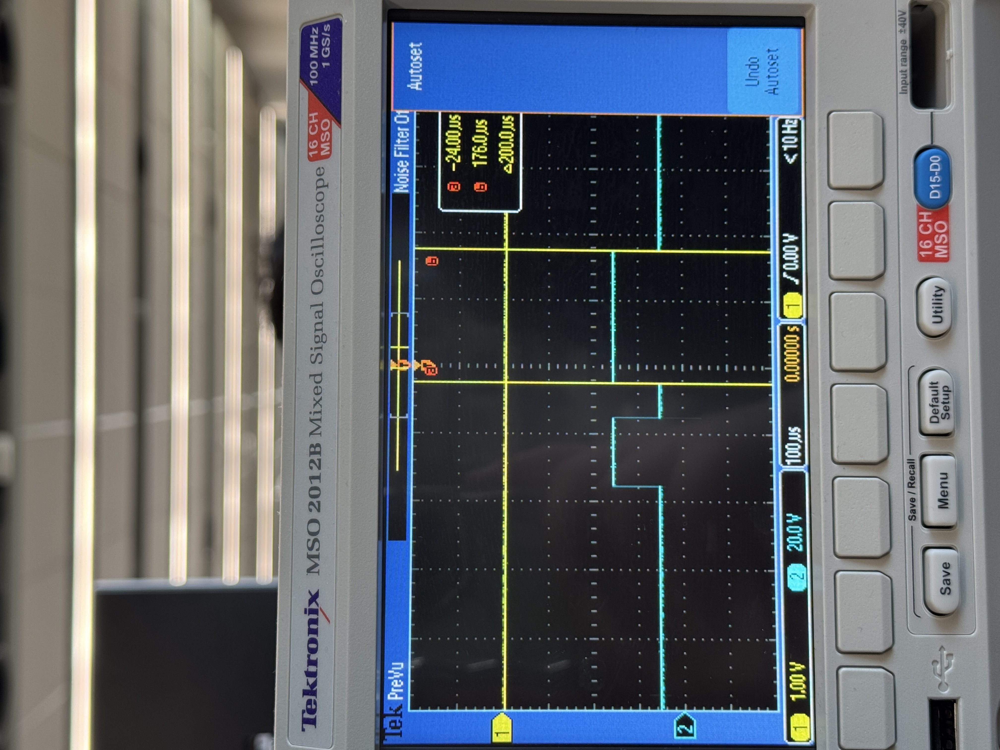

# Author
Student: Yiwen Kuang (Name on Canvas: Even)
ID: H00391696
Email: yk2011@hw.ac.uk

# ESP32 Real-Time Machine Monitor

This project implements two versions of a real-time machine monitoring system on ESP32:

1. **Cyclic Executive version** (no RTOS)
2. **FreeRTOS-based version**

Both versions are designed to meet strict real-time constraints and are tested using the provided `B31DGMonitor` library.

---

## Project Goals

The system fulfills **7 real-time requirements**, including:

- Digital signal generation (precise timing)
- Input frequency measurement (via polling)
- LED state control based on measured frequencies
- Button interaction and feedback
- Accurate real-time performance tracking using monitor

---

## How to Run

1. Use Arduino IDE or PlatformIO with ESP32 board selected.
2. Upload either version on src fold:
   - `CyclicExecutive.ino` — no FreeRTOS features used
   - `FreeRTOS.ino` — uses FreeRTOS tasks, semaphores, stack monitoring
3. Open Serial Monitor at 115200 baud to view real-time monitor output.
4. Optional: Connect oscilloscope or signal generator to verify signal inputs and outputs.

---

## Test Without Moniter


To test the system without real-time monitoring, use the versions inside the `test/` folder.

These versions are functionally identical, but `monitor.startMonitoring()` and all `jobStarted()` / `jobEnded()` calls have been commented out.

This allows you to:
- Observe system behavior without the monitor's overhead
- Simulate real deployment scenarios
- Debug pure task logic

---

## Hardware Summary

- **Left side LEDs (Red & Yellow):** show output signals from Task 1 and 2.
- **Green LED:** turns on when F1 + F2 > 1500 Hz (may flicker near threshold).
- **Right side Red LED:** toggled by pushbutton (Task 7).
- **Blue/Purple wires:** for oscilloscope probes or input test signals.


---

## Real-Time Validation

Both implementations use the `B31DGMonitor` to track task violations.  
A perfect output will show 0/XXXX violations per task:

```
PERFORMANCE SUMMARY
Task #1  0/2500 violations
Task #2  0/3333 violations
Task #3  0/1000 violations
Task #4  0/1000 violations
Task #5  0/2000 violations
```

---

## Oscilloscope Verification

To verify that the digital output signals generated by Task 1 and Task 2 match the specified timing (e.g. 250 µs HIGH, 50 µs LOW, etc.), we measured them using an oscilloscope.

The following images show the measured square waveforms, which confirm the correct timing patterns.

### Task 1 – Signal A (Expected: HIGH 250µs, LOW 50µs, HIGH 300µs)


### Task 2 – Signal B (Expected: HIGH 100µs, LOW 50µs, HIGH 200µs)




---

## Notes

- FreeRTOS version includes timing offset compensation (e.g., `monitor(1479)`) to account for scheduler startup delays.
- Stack sizes were tested using `uxTaskGetStackHighWaterMark()` and adjusted accordingly.
- Mutex is used in the FreeRTOS version to protect shared frequency data (F1, F2).

---
